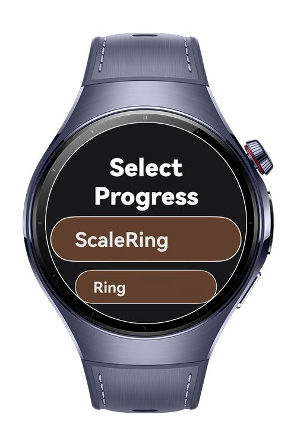
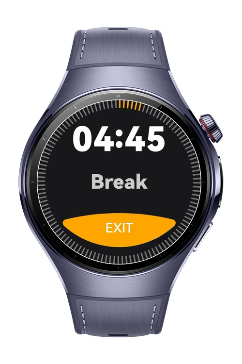
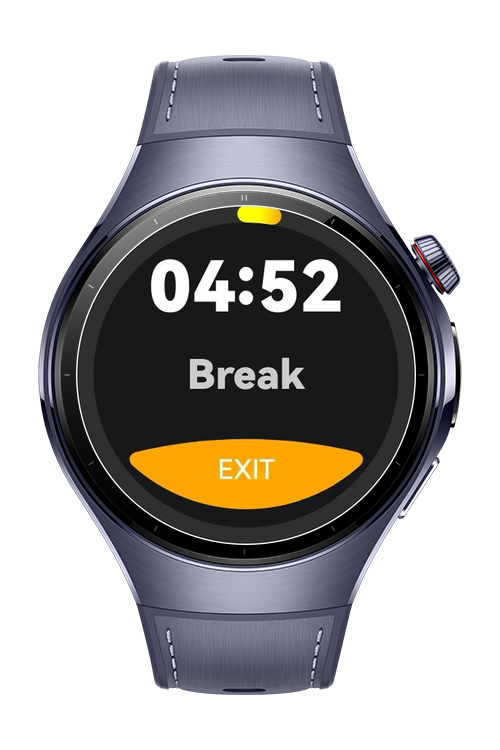

> **Note:** To access all shared projects, get information about environment setup, and view other guides, please visit [Explore-In-HMOS-Wearable Index](https://github.com/Explore-In-HMOS-Wearable/hmos-index).

# How to Use Ring and ScaleRing Progress Components

This is an HarmonyOS Next wearable app that demonstrates how to use a countdown timer together with progress components.
The project shows how to build and display both ScaleRingProgress and RingProgress in ArkTS using ArkUI.

# Preview

<div>
  
  
  
</div>

# Use Cases

Display a countdown timer with visual feedback using ScaleRing and Ring progress components on wearable.

# Tech Stack

**Languages**: ArkTS

**Frameworks**: HarmonyOS SDK 5.1.0(18)

**Tools**: DevEco Studio Vers 5.1.0.842

**Libraries**: @kit.ArkUI

# Directory Structure
```
entry/src/main/ets/
├── pages/
│   ├── Index.ets                # Main page
│   ├── ProgressListPage.ets     # List of available progress styles
│   ├── RingPage.ets             # Page showing Ring progress demo
│   └── ScaleRingPage.ets        # Page showing ScaleRing progress demo
│
├── services/
│   └── NavigationService.ets    # Handles navigation between pages
│
├── viewmodel/
│   └── ProgressViewModel.ets    # Manages logic
│
├── entryability/
│   └── EntryAbility.ets         # App ability
│
├── module.json5                 # App metadata, permissions, device config
└── build-profile.json5          # Build, signing, and SDK configuration
```

# Constraints and Restrictions

## Supported Device
- Huawei Watch 5

# License

**WearTimerBar** is distributed under the terms of the MIT License.

See the [LICENSE](/LICENSE) for more information.